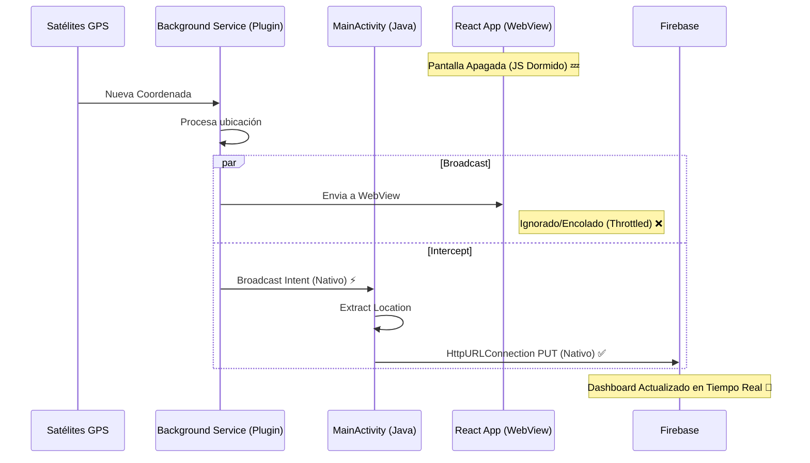

# Solución Técnica: Transmisión de Ubicación en Segundo Plano (Native Interceptor)

## 🛑 El Problema
Android moderniza agresivamente la gestión de batería. Cuando una aplicación híbrida (Capacitor/Ionic/React) pasa a segundo plano o se apaga la pantalla:
1.  **WebView "Congelado":** El hilo de Javascript se pausa para ahorrar CPU.
2.  **Network Throttling:** Las peticiones `fetch()` o `axios` se encolan y no salen hasta que el usuario vuelve a abrir la app (efecto "Burst").

## ✅ La Solución (v4.1)
En lugar de luchar contra el sistema operativo intentando mantener despierto el Javascript, utilizamos la capa **Nativa (Java)** para interceptar los datos del GPS y enviarlos directamente, puenteando totalmente la interfaz gráfica.

### Arquitectura "Native Broadcast Interceptor"

1.  **Plugin GPS (Proveedor):**
    El plugin `@capacitor-community/background-geolocation` ejecuta un **Foreground Service** (notificación permanente). Este servicio tiene permiso del sistema para obtener coordenadas GPS continuamente.
    *   Internamente, este plugin emite un **Broadcast Intent** (un "grito" interno en Android) cada vez que tiene una nueva ubicación. Acción: `com.equimaps.capacitor_background_geolocation.broadcast`.

2.  **MainActivity (Interceptor):**
    En `MainActivity.java`, registramos un **BroadcastReceiver**. Este es un "oido" nativo que escucha ese canal específico.
    ```java
    // MainActivity.java
    LocalBroadcastManager.getInstance(this).registerReceiver(new BroadcastReceiver() { ... }, filter);
    ```

3.  **Transmisión Nativa (Java HTTP):**
    Cuando el Interceptor recibe los datos:
    *   Extrae latitud/longitud del objeto `Location` nativo.
    *   Crea un hilo separado (`new Thread()`).
    *   Usa `HttpURLConnection` (librería estándar de Java) para hacer el `PUT` a Firebase.

### ¿Por qué funciona?
El código Java nativo de una aplicación con un Foreground Service activo **NO** es restringido por el ahorro de batería de la misma forma que el WebView (Chrome). Android permite que el servicio ejecute código de red libremente mientras la notificación esté visible.

### Diagrama de Flujo



## Requisitos Técnicos
1.  **Dependencia:** `implementation "androidx.localbroadcastmanager:localbroadcastmanager:1.1.0"` en `build.gradle`.
2.  **Permiso:** `FOREGROUND_SERVICE` y `INTERNET` en `AndroidManifest.xml`.
3.  **Configuración:** Plugin configurado para trabajar, pero la lógica de envío reside en `MainActivity`.

## 🛡️ Casos de Estudio y Prevención (v5.0)

Durante la fase de estabilización final, identificamos y resolvimos 3 problemas críticos que pueden servir de lección para futuros mantenimientos:

### 1. El Mito del "Ahorro de Batería" (Rastreo Intermitente)
*   **Síntoma:** El rastreo funcionaba bien unos minutos y luego se detenía por completo al bloquear la pantalla.
*   **Causa:** Aunque teníamos un Foreground Service, Android OS en dispositivos Samsung/Xiaomi pone la app en "Suspensión Profunda" si no interactúas con ella.
*   **Solución:** Implementamos `BatteryOptimization.requestIgnoreBatteryOptimizations()` justo antes de iniciar el GPS. Esto solicita al usuario (o al sistema) poner la App en la lista blanca de energía.
*   **Prevención:** Siempre incluir el permiso `REQUEST_IGNORE_BATTERY_OPTIMIZATIONS` y llamar al plugin antes de cualquier tarea larga.

### 2. La Carrera de Salida (Race Condition)
*   **Síntoma:** Al cerrar sesión, el pin del mapa se quedaba "pegado" para siempre.
*   **Causa:** El código de Javascript ejecutaba `logout()` (borrar token) *antes* de que la petición de red `checkout()` terminara de viajar al servidor. La App moría antes de despedirse.
*   **Solución:** 
    1. Convertimos la función `handleLogout` en `async/await`.
    2. Introdujimos un **buffer de seguridad** (`setTimeout` de 2500ms) después de detener el GPS. Esto permite que cualquier petición HTTP nativa en vuelo termine *antes* de que enviemos el estado final `OFFLINE`.
*   **Prevención:** Nunca confiar en "fuego y olvido". En sistemas híbridos, dar tiempo a la capa nativa para aterrizar antes de matar el WebView.

### 3. Sensibilidad del GPS (Falso Positivo de Fallo)
*   **Síntoma:** "El rastreo no funciona, solo envió una vez".
*   **Causa:** Teníamos configurado `distanceFilter: 10` (metros). Al hacer pruebas de escritorio (sentado), el GPS no detectaba movimiento suficiente y, correctamente, no enviaba nada. Esto se confundía con un fallo.
*   **Solución:** Para pruebas y máxima precisión, cambiamos a `distanceFilter: 0`.
*   **Prevención:** Distinguir entre configuración de "Producción" (ahorro de datos) y "Test" (sensibilidad máxima).
